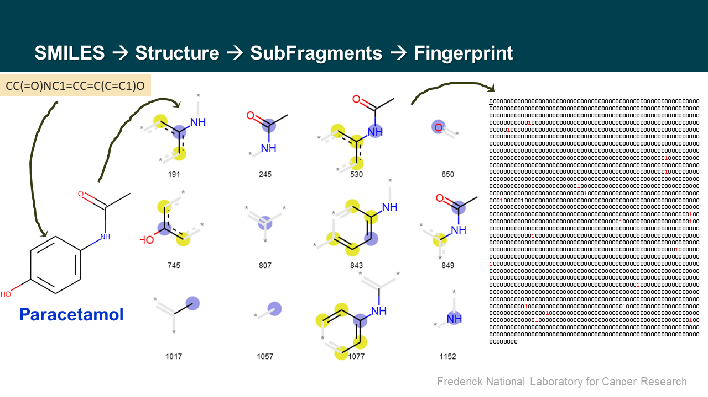

### ML-TC1 Workshop: 

**Using Machine Learning to Generate Molecular Descriptors for Drug Function Classification**


#### Overview 
This workshop will introduce the concepts 



#### Agenda


**Workshop website:**
[https://github.com/ravichas/ML-predict-drugclass](https://github.com/ravichas/ML-predict-drugclass)


```
Date: 		TBD
Registration Link: Coming-soon

Time:		TBD
Location:	TBD
Instructor:	Sarangan Ravichandran, PhD, PMP
                Data Scientist
                FNLCR, BIDS 
```

#### Click [here](./../Docs/DrugTypeClassModeling-slides.pdf) to view the workshop slides. 
#### Click [here](./../Docs/predict-drugclass-toolsreview.pdf) to view the workshop hands-on exercise Notebook (Jupyter)

